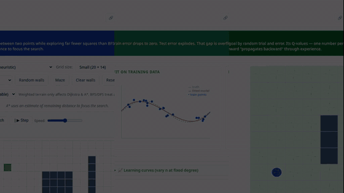

# AI Playgrounds

> **Start in five minutes:** open the live site, choose one applet, make a prediction, change one variable, and explain the trace. The suite contains 13 multilingual, offline-ready applets with deterministic algorithm and browser verification. [Live suite](https://lmdixon23.github.io/ai-playgrounds/) · [Educator guide](docs/EDUCATOR_ADOPTION_GUIDE.md) · [Release status](docs/RESEARCH_COMPANION_STATUS.md) · [Analytics and privacy](docs/ANALYTICS_AND_PRIVACY.md)

**Evidence boundary:** release checks establish bounded software behaviour and deployment integrity; they do not establish learning gains, classroom adoption, or accessibility conformance.

[](https://github.com/lmdixon23/ai-playgrounds/actions/workflows/verify.yml)
[](https://github.com/lmdixon23/ai-playgrounds/actions/workflows/deploy-pages.yml)
[](LICENSE)
[](https://doi.org/10.5281/zenodo.21854217)

Thirteen multilingual, offline-ready interactives for foundational artificial intelligence. The suite covers search, logic, probability, machine learning, neural networks, computer vision, reinforcement learning, and Transformer language modeling.

**Live site:** https://lmdixon23.github.io/ai-playgrounds/

**Current release:** [v1.2.0](https://github.com/lmdixon23/ai-playgrounds/releases/tag/v1.2.0)

**Archived v1.0.1 DOI:** [10.5281/zenodo.21854217](https://doi.org/10.5281/zenodo.21854217) · **All-versions DOI:** [10.5281/zenodo.21854216](https://doi.org/10.5281/zenodo.21854216)

### 15-second demo

[](https://lmdixon23.github.io/ai-playgrounds/media/AI_Playgrounds_Demo_15s.mp4)

**[▶ Open the full-resolution demo](https://lmdixon23.github.io/ai-playgrounds/media/AI_Playgrounds_Demo_15s.mp4)**

## Why this project exists

Foundational AI concepts are dynamic. A search frontier expands, evidence changes a posterior probability, a model begins to overfit, value propagates through repeated experience, or causal self-attention changes a next-token distribution.

AI Playgrounds turns those mechanisms into direct experiments that learners can manipulate before implementing them in code.

Each applet includes:

- one focused AI concept,
- multilingual learner-facing support across English, Simplified Chinese, Vietnamese, and Spanish,
- a featured experiment and scenario gallery,
- visual and text-based explanations,
- teacher notes and model limitations,
- a local student response packet or equivalent prediction workflow,
- keyboard guidance,
- shareable or reproducible experiment state where appropriate,
- offline-ready operation without an account or backend.

## Lab 13: Transformer Language Modeling

v1.2.0 adds a deterministic decoder-like teaching model that connects token IDs, token and position vectors, Q/K/V projections, causal masking, self-attention, logits, temperature, and next-token probabilities. Its browser arithmetic is cross-checked against an independent Python reference and the same frozen fixtures are exercised in JavaScript and browser QA.

The applet explicitly distinguishes attention weights from a general explanation of model reasoning, separates argmax probability from sampling, and treats its tokenizer and weights as small teaching fixtures rather than a reproduction of a frontier LLM.

## Explore

Use the live site or build the deterministic Pages artifact with:

```bash
python tools/build_site.py
```

The deployed applets require no server, account, package manager, or backend. Lab 13 is generated into the minimal Pages artifact from its frozen English source plus audited four-locale catalogs, producing one self-contained HTML file.

## Verification

The repository uses complementary verification layers:

```bash
python tools/release_check.py
python tools/run_algorithm_tests.py
python tools/test_transformer_public_integration.py
python tools/browser_qa.py --no-screenshots
```

The inherited algorithm gate requires all 45 legacy regression cases to pass with no skipped cases. Lab 13 adds 20 independent numeric fixtures, Python-to-JavaScript parity, prototype and English-source browser gates, ZH and VI/ES semantic parity gates, four-locale state/arithmetic parity, and a public v1.2 integration gate. GitHub Actions runs the cumulative verification stack on pushes and pull requests.

## Teaching materials

- [Teacher Pack](teacher-pack.html)
- [Curriculum Map](curriculum.html)
- [Student Lab Sheet](student-lab.html)
- [How the project works](quality.html)
- [Research and citation](research-and-citation.html)

## Research status

AI Playgrounds v1.2.0 is the current software release. The earlier v1.0.1 artifact remains immutable and archived at its version DOI. Its DOI should not be interpreted as a DOI for v1.2.0.

A separate design-and-tools research manuscript about the suite remains in preparation. Publication of the software is not publication of that manuscript.

## Reuse and citation

The project is released under the MIT License.

- [Architecture](ARCHITECTURE.md)
- [Contributing](CONTRIBUTING.md)
- [Citation metadata](CITATION.cff)
- [Release notes](RELEASE_NOTES.md)
- [Localization standard](docs/LOCALIZATION.md)

Built by Logan M. Dixon

- [Portfolio](https://lmdixon23.github.io/)
- [ORCID](https://orcid.org/0009-0001-0592-462X)
- [GitHub repository](https://github.com/lmdixon23/ai-playgrounds)
- [Releases](https://github.com/lmdixon23/ai-playgrounds/releases)

## Contributing

Start with the [bounded contributor on-ramp](docs/CONTRIBUTOR_ONRAMP.md). Educator feedback, translation review, accessibility observations, deterministic edge cases, and small lesson activities are preferred over unscoped feature requests.
